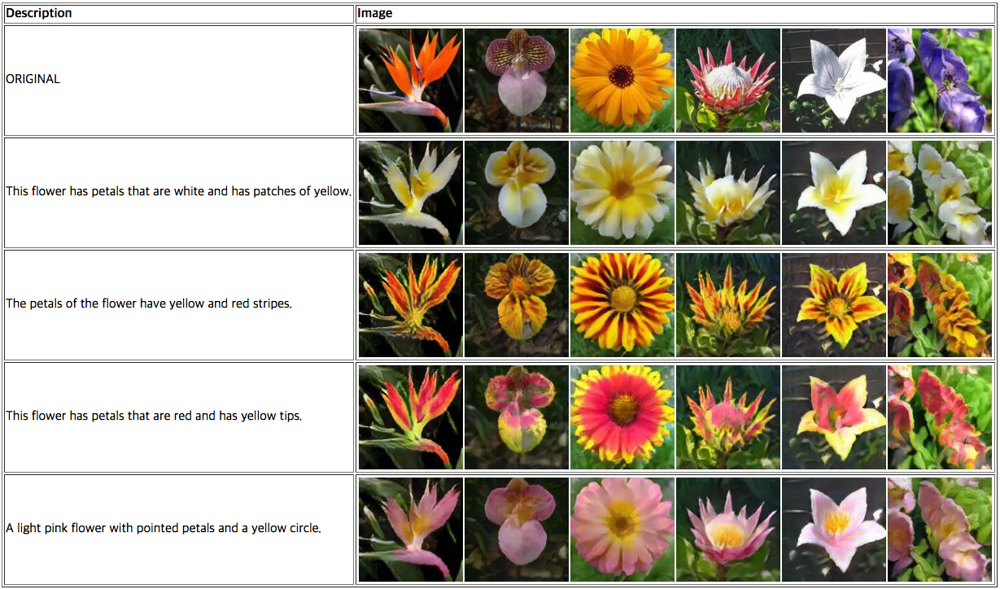
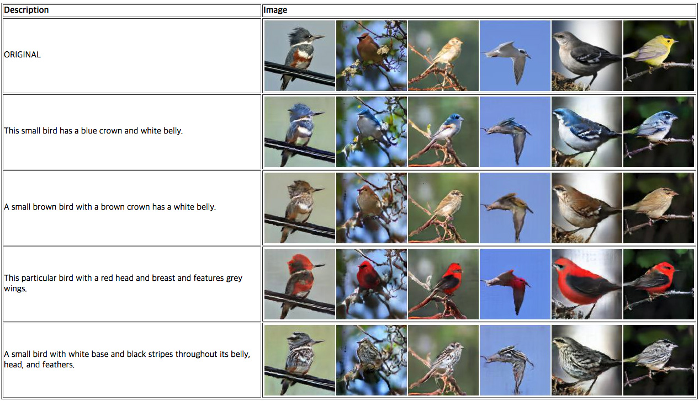

# Attribute Manipulation

## Pretrained word vectors for fastText
Download a pretrained [English](https://dl.fbaipublicfiles.com/fasttext/vectors-wiki/wiki.en.zip) word vectors. You can see the list of pretrained vectors on [this page](https://github.com/facebookresearch/fastText/blob/master/docs/pretrained-vectors.md).

## Datasets
- Oxford-102 flowers: [images](http://www.robots.ox.ac.uk/~vgg/data/flowers/102) and [captions](https://drive.google.com/file/d/0B0ywwgffWnLLMl9uOU91MV80cVU/view?usp=sharing)
- Caltech-200 birds: [images](http://www.vision.caltech.edu/visipedia/CUB-200-2011.html) and [captions](https://drive.google.com/file/d/0B0ywwgffWnLLLUc2WHYzM0Q2eWc/view?usp=sharing)

The caption data is from [this repository](https://github.com/reedscot/icml2016). After downloading, modify `CONFIG` file so that all paths of the datasets point to the data you downloaded.

## Pretrained models
- Oxford-102 flowers: [flowers_G.pth](https://www.dropbox.com/s/jb8h8agu6c9zs6r/flowers_G.pth?dl=0)
- Caltech-200 birds: [birds_G.pth](https://www.dropbox.com/s/owpfetbrmmvj5f4/birds_G.pth?dl=0)

Please put these files in `./models/` folder.

## Run
- `scripts/preprocess_caption.sh`  
Preprocess caption data using fastText embedding. You only need to run it once before training.
- `scripts/train_[flowers/birds].sh`  
Train a network. If you want to change arguments, please refer to `train.py`.
- `scripts/test_[flowers/birds].sh`  
Test a trained network. After running it, please see `./test/result_[flowers/birds]/index.html`.

## Results

